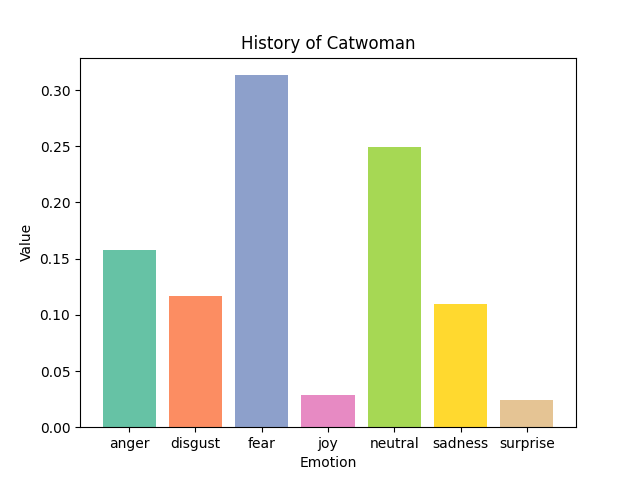
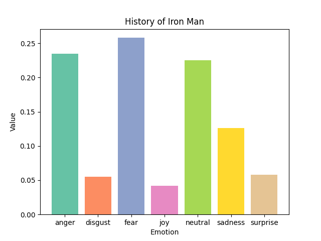
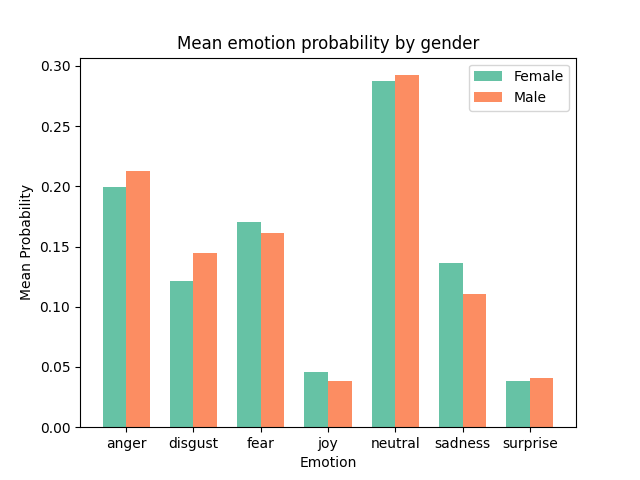

# The emotional fingerprint of superheroes' backstories
## Intro
A lot of people enjoy superhero movies, but some individuals take their love for superheroes to the next level by creating a [database](https://www.superherodb.com/) that contains information on over 6200 superheroes, including their power scores and origin stories. As someone who equally loves superheroes and data science, this is fantastic news for me. I am particularly fascinated by superhero origin stories, which seem to follow a set template:

1) The person starts with a relatively normal life
2) Something tragic happens
3) The person gains superpowers
4) The superhero must fight evil and come to terms with the tragic event

This made me wonder if this pattern would be evident by extracting emotions from these backstories. Fortunately, thanks to the power of machine learning, I can do just that! In this repository, you will find the necessary code to determine the most probable emotions in your favourite superheroes' backstories, using a [transformer from huggingface.](https://huggingface.co/j-hartmann/emotion-english-distilroberta-base)

Now, I must confess that I have some grievances with the superhero industry. The lack of female superheroes is especially bothersome to me. In the presented [dataset from kaggle](https://www.kaggle.com/datasets/jonathanbesomi/superheroes-nlp-dataset), only 23% of the superheroes are female. This tendency to treat genders differently led me to question whether male and female heroes have different backstories. To address this, I have included a script that calculates the mean probability of each emotion across male and female backstories. The results are presented at the end of this readme. Enjoy!

## How to run

To run the code within this repository, you first have to setup a virtual environment containing all the necessary modules. I have provided a script that does this for you, and all you need on your computer beforehand is [pip](https://pypi.org/project/pip/) and [python](https://www.python.org/). The code was developed on ubuntu Debian GNU/Linux 11 (bullseye) with python 3.9.2 and pip 23.1.2. The computer did not have venv although it is a default part of python, so it is installed in setup.sh [line 2]() and [line 3](). Additionally pip is upgraded in [line 12](). Remember to modify this to suit your needs.

### Get kaggle datasets
This code downloads data through the kaggle API. You need to sign up to [kaggle.com](https://www.kaggle.com/) and though your account, download your personal token - a json file. If you are unsure of how to do this, you can read kaggle's description below:

*"From the site header, click on your user profile picture, then on “My Account” from the dropdown menu. This will take you to your account settings at https://www.kaggle.com/account. Scroll down to the section of the page labelled API. To create a new token, click on the “Create New API Token” button. This will download a fresh authentication token onto your machine."*

**Move the token into the data folder** - then you're ready to run the code:

### Execute the code

In the terminal, navigate to this repository and run the following:
```
bash setup.sh
```
This downloads the data and installs the necessary modules in a virtual environment. Then, to produce the desired outputs, run the following code:
```
bash run.sh
```

## Output

In plots you will find a bar plot showing emotion probabilities for individual superheroes, and mean barplots for two genders.

## Repository structure
```
  ├── data
  │   └── kaggle.sh               <- Bash script downloading the datasets
  ├── plots
  │   └── ..
  ├── src
  │   ├── get_emotions.py         <- Script extracting emotions
  │   ├── plot_a_gender.py        <- Script plotting for gender
  │   └── plot_a_super.py         <- Script plotting for an individual hero
  ├── utils
  │   ├── fun.py                  <- Various functions utilised in scripts
  │   └── plot.py                 <- Functions specifically used for plotting
  ├── .gitignore
  ├── LICENSE
  ├── README.md
  ├── requirements.txt            <- .txt containing needed modules and versions
* ├── run.sh                      <- Script that runs the code within the virtual environment
  └── setup.sh                    <- Script that sets up the virtual environment and downloads data
  
* files that you can change if you wish to customise the code.
```

## Customising
The script plot_a_super.py can be run with a --name flag, and produces a barplot with the most likely emotions of the hero's backstory. Look through the "name" column of the emotions.csv to find the name of your favourite hero. Note: You just need to run the get_emotion.py script once, so modify the run.sh by commenting out [line 5]() if you want plots for multiple heroes.

## Evaluation
Lets have a look at the most probable emotions of Catwomans backstory:


The most likely emotion is fear. If we read just the first line of her origin story, I would say this assessment is pretty spot on:
> *"Selina Kyle's early life was defined by tragedy. When she was just a girl, her brutalized mother Maria committed suicide and her violent father Brian drank himself to death not long after."*

Lets have a look at a male superhero, Iron Man:



 The probabilities are quite similar, however Mr. Starks backstory seem to contain more rage. However, if we compare the average probabilities of emotions across gender, we see no large differences. Of course, a statistical analysis would be needed to investigate whether any significant differences are present:
 
 


###### This repository is part of a portfolio exam in [Language Analytics](https://kursuskatalog.au.dk/en/course/115693/Language-Analytics), which is one of the courses of the supplementary subject [Cultural Data Science at Aarhus University](https://bachelor.au.dk/en/supplementary-subject/culturaldatascience/). You can see an overview of all the projects I have completed for this subject [here](https://github.com/AddiH/Cultural_Data_Science). MIT licence applies. 
